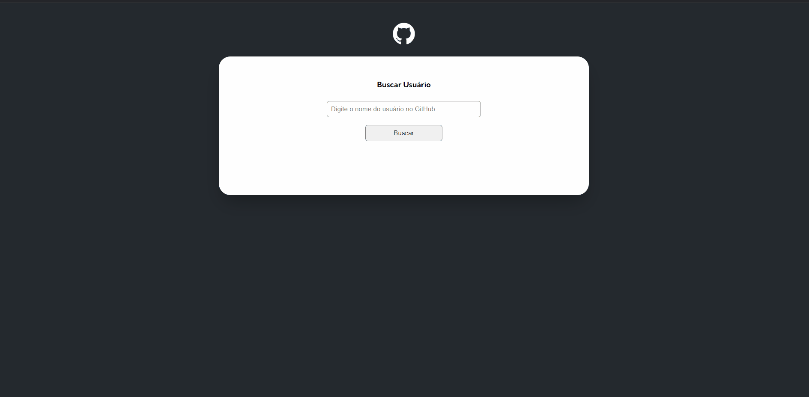

# projeto-inicial-fetch-github-api

Este projeto foi uma "quest" do curso dev-quest, desenvolvida para aplicar conhecimentos de HTML, CSS e JavaScript e finalizar um módulo do curso. Trata-se de um projeto que consome uma a API do GitHub e busca dados de um usuário mostrando as informações na tela

## Preview




## Tecnologias Utilizadas

- **HTML**: Usado para a estrutura da página
- **CSS**: Utilizado para estilização e layout
- **JavaScript**: Usado para a interação do usuario


## Estrutura do código

```plaintext
├── index.html
│   
├── src/
│   ├── CSS/
│   │   ├── reset.css
│   │   │
│   │   │
│   │   └──styled.css
│   │
│   │
│   └── scripts
│       ├── objects/
│       │    ├── repositories.js
│       │    │
│       │    │
│       │    └── user.js
│       │
│       │
│       ├── services/
│       │    ├── screen.js
│       │    │
│       │    │
│       │    └── user.js
│       │
│       │
│       ├── index.js
│       │
│       │
│       └── variables.js
│
│
│
└── README.md
```
